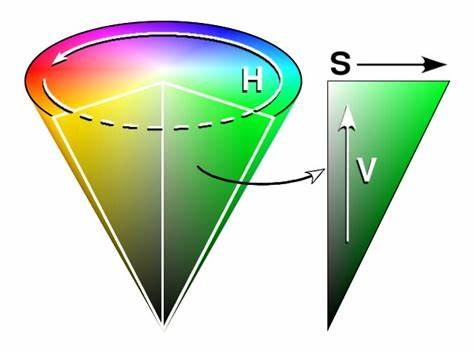
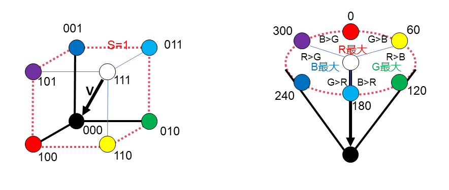
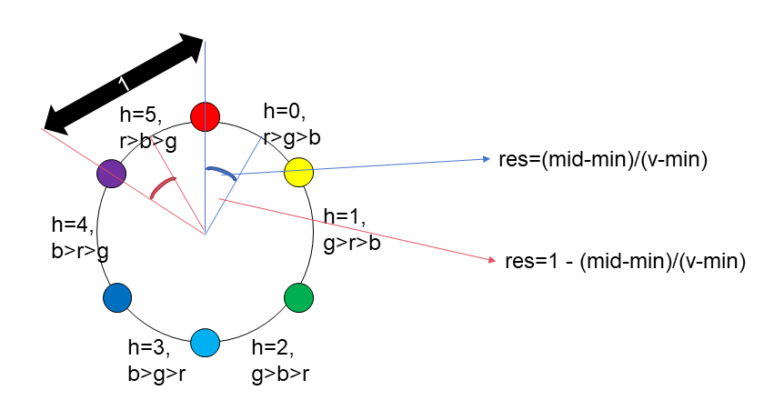

#### hsv颜色空间

##### 概述

对于彩色图片的每个像素点，其颜色由RGB三个维度的值表示，RGB分别代表红色、绿色、蓝色成分的多少。因此一组RGB值（对应RGB立方体内的每一个点）代表了一种颜色，反之亦然，任意一种颜色可用一组RGB值表示（是RGB立方体内的一个点）。


但对于人而言，对一个颜色，直观感知到的是其色调、亮度等信息，而这些信息在RGB值的表示下并不直观。单看RGB值的大小，人很难感受到其对应的色调等信息，自然也不便于对其修改。

通过定义一种映射变换，将RGB立方体映射为HSV圆锥（或者圆柱）：RGB立方体的每一个位置（每一种颜色），都有一个对应的HSV圆锥中的位置。这样任意一种颜色将对应一组HSV值（即HSV圆锥中的一个位置），而这个HSV值可以直观的表示该颜色的色调，亮度等信息。


HSV三个值中：
H全称为Hue色调，在圆锥中为绕圆锥轴的水平角。其表示了颜色种类，范围0-360度，随数值变化颜色色调渐变循环。
S全称为Saturation饱和度，在圆锥中为距离圆锥轴的水平距离。其揭示了色彩的饱满程度（越高颜色越明显，越低颜色越接近黑白灰，具体黑白灰取决于明度），范围0-1。
V全称为明度Value，在圆锥中指距离圆锥尖的垂直距离。其表示该色彩的明亮程度（越高越亮越白，反之越暗越黑），范围0-1。



由此，只要将颜色信息从RGB值转换到HSV值（或者说RGB立方体空间转换到HSV圆锥空间），我们就能获取到直观的亮度，对比度，色调信息。

##### 公式

**RGB->HSV**

$$
V = \max(R,G,B)
$$

明度Value取的是RGB三个通道的最大值，RGB值中的最大值越大，亮度越高（白色和三原色是同样明度的）。
这意味着RGB立方体的三个外层面变形成为了HSV圆锥的底面。RGB立方体的体对角线变为了HSV圆锥的轴。

$$
\begin{equation*}
S = \begin{cases}
(V-\min(R,G,B))/V \qquad if \ V \neq 0 \\
0 \qquad \qquad \qquad \qquad \qquad \quad \ if \ V = 0
\end{cases}
\end{equation*}\\
$$

饱和度的公式表示了色彩纯度。RGB值中的最小值越低，饱和度越高。或者说RGB三个值中，最大值与最小值差的越大，饱和度越高。如果RGB三个值相同，这相当于饱和度为0的情况，也就是HSV圆锥的轴，黑白灰。HSV的圆周处饱和度均为最大值1，这可对应到RGB立方体的几条棱，这些棱都是可保证RGB最大值为255，最小值为0，至于中间值可以任取，不会影响到饱和度。

$$
\begin{equation*}
H=\begin{cases}
60(G-B)/({V-\min(R,G,B)})\qquad \qquad if \ V=R \ and \ G \ge B\\
360 + 60(G-B)/({V-\min(R,G,B)})\quad \ if \ V=R \ and \ G < B\\
120 + 60(B-R)/({V-\min(R,G,B)})\quad \ if \ V=G\\
240 + 60(R-G)/({V-\min(R,G,B)})\quad \ if \ V=B\\
0 \qquad \qquad \qquad \qquad \qquad \qquad \qquad \qquad \quad if \ R=G=B\\
\end{cases}
\end{equation*}
$$

色调公式尽管复杂，但道理很简单，将360度角度分为3部分，RGB各占1/3区域。RGB中哪个值最大，就在哪个区域中；在该区域中，RGB中剩下两个值哪个大，就更偏向于哪一侧。（这将同时保证RGB值中最大值对应区域的对侧，是其值最小的区域；另外60度角所乘的分式，其范围为-1~1，因此最大值为R或G或B的三个情况各占120度）



**HSV->RGB**

对于逆变换，通过反解RGB->HSV公式，求出RGB三者中最大值、最小值、中间值的大小。再根据Hue所处的区间，确定RGB三个值的大小关系，把从大到小的三个值和RGB进行对应。

先将色调Hue除60得到商h和余数res。

$$
h = H//60 \\
res = H/60 - h \\
$$

Value为RGB三者中的最大值。

$$
max = V
$$

根据Saturation公式反解出RGB三者中的最小值。

$$
S = (V-min)/V \\ 
\ \ \\
min= V - SV\\
$$

根据Hue公式反解出RGB三者中的中间值。注意，中间值根据h的奇偶，需要分情况。

$$
\begin{equation*}
res = \begin{cases} 
(mid-min)/(V-min) \quad\quad\quad\ \ \     if \ h=0,2,4\\
1 - (mid-min)/(V-min) \quad\quad if \ h=1,3,5\\
\end{cases}
\end{equation*}\\
\ \ \\

\begin{equation*}
mid = \begin{cases} 
res(V-min)+min \quad\quad\quad\quad\ \    if \ h=0,2,4\\
(1-res)(V-min)+min \quad\quad if \ h=1,3,5\\
\end{cases}
\end{equation*}\\
$$

求出RGB三者中的最大值，中间值，最小值后，根据h的值判断RGB的大小关系，将最大值、中间值、最小值对应的赋给R、G、B。

$$
\begin{equation*}
(R,G,B) =  \begin{cases}
(max,mid,min)\quad \ if \ h=0\\
(mid,max,min)\quad \ if \ h=1\\
(min,max,mid)\quad \ if \ h=2\\
(min,mid,max)\quad \ if \ h=3\\
(mid,min,max)\quad \ if \ h=4\\
(max,min,mid)\quad \ if \ h=5\\
\end{cases}
\end{equation*}\\
$$



##### 代码

```python
import cv2
import numpy as np

'创建示例，单个像素'
rgb = np.zeros((1,1,3),'uint8')
rgb[:,:,0] = 10 #R
rgb[:,:,1] = 20 #G
rgb[:,:,2] = 45 #B


'自写方法'
def rgb2hsv(rgb):#入参rgb为uint8格式

    H,W,C = rgb.shape #获取图片尺寸
    hsv = np.zeros_like(rgb,float) 

    #归一化，RGB范围0~255->0~1
    r,g,b = rgb[:,:,0]/255,rgb[:,:,1]/255,rgb[:,:,2]/255 
    
    
    #对图片的每个像素点进行RGB->HSV的转换
    for y in range(H):
        for x in range(W):
            Cmax = max(r[y,x],g[y,x],b[y,x])
            Cmin = min(r[y,x],g[y,x],b[y,x])
            hsv[y,x,2] = Cmax #求取V
            hsv[y,x,1] = (Cmax-Cmin)/Cmax if Cmax!=0 else 0 #求取S
            #求取H
            if Cmax == Cmin:
                hsv[y,x,0] = 0
            elif Cmax == r:
                if g>=b:
                    hsv[y,x,0] = 60*(g[y,x]-b[y,x])/(Cmax-Cmin) 
                else:
                    hsv[y,x,0] = 60*(g[y,x]-b[y,x])/(Cmax-Cmin) + 360
            elif Cmax == g:
                hsv[y,x,0] = 60*(b[y,x]-r[y,x])/(Cmax-Cmin) + 120
            elif Cmax == b:
                hsv[y,x,0] = 60*(r[y,x]-g[y,x])/(Cmax-Cmin) + 240

    #uint8格式，可存储的数值范围为0~255的整数，因此要对hsv值调整        
    hsv[:,:,2] = np.round(hsv[:,:,2]*255) #调整V范围0~1->0~255
    hsv[:,:,1] = np.round(hsv[:,:,1]*255) #调整S范围0~1->0~255
    hsv[:,:,0] = np.round(hsv[:,:,0]/2) #调整H范围0~360->0~180

    return hsv.astype('uint8') #输出时格式转为uint8


def hsv2rgb(hsv):#入参hsv为uint8格式
    #还原因为uint8格式而受限的hsv范围，S&V：0~255->0~1，H：0~180->0~360  
    h,s,v =  hsv[:,:,0]*2,hsv[:,:,1]/255,hsv[:,:,2]/255
    
    H,W,C = hsv.shape #获取图片尺寸
    rgb = np.zeros_like(hsv,float)
    
    #对图片的每个像素点进行HSV->RGB的转换
    for y in range(H):
        for x in range(W):
            h_index= h[y,x]//60 #根据色调判断色区 #商
            h_remain = h[y,x]/60 - h_index #余数（除60）

            #根据RGB->HSV的公式反解，求从大到小的三个值
            Cmax = v[y,x]
            Cmin = v[y,x]*(1 - s[y,x])
            Cmid_pos = v[y,x]*(1-s[y,x]+s[y,x]*h_remain)
            Cmid_neg = v[y,x]*(1-s[y,x]*h_remain)
            
            #根据H商所处的区域可得RGB三者大小关系，将其与所求的从大到小三个值对应
            if h_index == 0 : #r>g>b
                rgb[y,x,0] = Cmax
                rgb[y,x,1] = Cmid_pos
                rgb[y,x,2] = Cmin
            elif h_index == 1: #g>r>b
                rgb[y,x,1] = Cmax
                rgb[y,x,0] = Cmid_neg
                rgb[y,x,2] = Cmin
            elif h_index == 2: #g>b>r
                rgb[y,x,1] = Cmax
                rgb[y,x,2] = Cmid_pos
                rgb[y,x,0] = Cmin
            elif h_index == 3: #b>g>r
                rgb[y,x,2] = Cmax
                rgb[y,x,1] = Cmid_neg
                rgb[y,x,0] = Cmin
            elif h_index == 4: #b>r>g
                rgb[y,x,2] = Cmax
                rgb[y,x,0] = Cmid_pos
                rgb[y,x,1] = Cmin
            elif h_index == 5: #r>b>g
                rgb[y,x,0] = Cmax
                rgb[y,x,2] = Cmid_neg
                rgb[y,x,1] = Cmin

    #uint8格式，将求得的RGB范围由0~1调整到0~255
    rgb[:,:,2] = np.round(rgb[:,:,2]*255)
    rgb[:,:,1] = np.round(rgb[:,:,1]*255)
    rgb[:,:,0] = np.round(rgb[:,:,0]*255)                
        
    return rgb.astype('uint8') #输出时格式转为uint8


'调用函数'
#RGB->HSV
hsv1 = cv2.cvtColor(rgb,cv2.COLOR_RGB2HSV) #opencv现成方法
hsv2 = rgb2hsv(rgb) #自写方法
print(hsv1,hsv2) #[[[111 198  45]]] [[[111 198  45]]]

#HSV->RGB
re_rgb1 = cv2.cvtColor(hsv1, cv2.COLOR_HSV2RGB)
re_rgb2 = hsv2rgb(hsv2)
print(re_rgb1,re_rgb2) #[[[10 21 45]]] [[[10 21 45]]]
```

##### 应用
