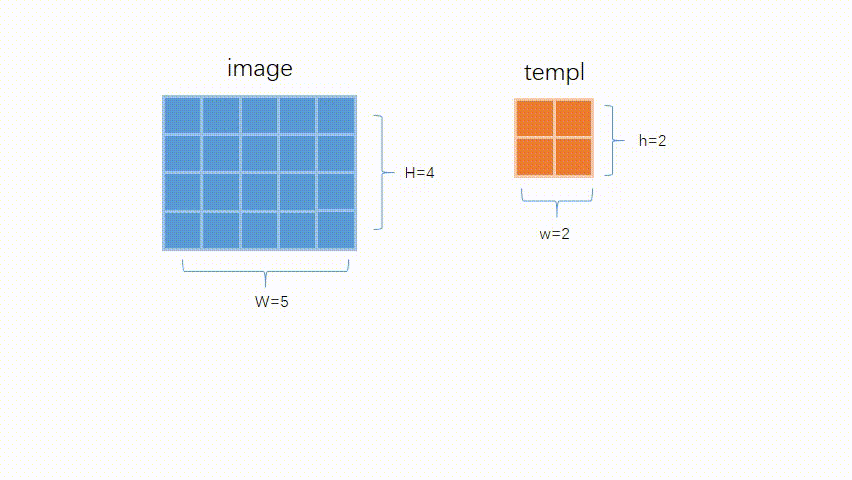

cv模板匹配

`cv2.matchTemplate(image,templ.method)`

image：所要进行检测的图像，array，尺寸为（H，W）

templ：所要进行匹配的模板，array，尺寸为（h，w）

函数是在image图像范围内，找到templ对应的图像内容是否存在及其存在位置，或者说计算image每个位置其内容与templ内容的对应程度。

函数返回值result，array，尺寸为（H-h+1，W-w+1）

计算对应程度是针对两个同样大小的图片，也即是templ的尺寸（h，w）。计算过程中，对所要检测的图像image是按滑窗平移，按行列逐个的截取其一部分与templ进行计算，得到结果中的一个值（与卷积类似）。因此结果尺寸为（H-h+1，W-w+1）

method：取值0-5，表示不同的计算对应程度的方法。

| method值 | cv方法名                | 函数公式                                                                                                                                                                                    |
| ------- | -------------------- | --------------------------------------------------------------------------------------------------------------------------------------------------------------------------------------- |
| 0       | cv2.TM_SQDIFF        | $R(x,y)=\sum_{x',y'}(T(x',y')−I(x+x',y+y'))^2$                                                                                                                                          |
| 1       | cv2.TM_SQDIFF_NORMED | $R(x,y)=\frac {\sum_{x',y'}(T(x',y')−I(x+x',y+y'))^2}{\sqrt{\sum_{x',y'}T(x',y')^2\cdot\sum_{x',y'}I(x+x',y+y')^2}}$                                                                    |
| 2       | cv2.TM_CCORR         | $R(x,y)=\sum_{x',y'}(T(x',y')\cdot I(x+x',y+y'))$                                                                                                                                       |
| 3       | cv2.TM_CCORR_NORMED  | $R(x,y)=\frac {\sum_{x',y'}(T(x',y')\cdot I(x+x',y+y'))}{\sqrt{\sum_{x',y'}T(x',y')^2\cdot\sum_{x',y'}I(x+x',y+y')^2}}$                                                                 |
| 4       | cv2.TM_CCOEFF        | $R(x,y)=\sum_{x',y'}(T'(x',y')\cdot I'(x+x',y+y'))$ where $T'(x',y')=T(x',y')−1/(w⋅h)⋅∑_{x'',y''}T(x'',y'')$ $I'(x+x',y+y')=I(x+x',y+y')−1/(w⋅h)⋅∑_{x'',y''}I(x+x'',y+y'')$ |
| 5       | cv2.TM_CCOEFF_NORMED | $R(x,y)=\frac {\sum_{x',y'}(T'(x',y')\cdot I'(x+x',y+y'))}{\sqrt{\sum_{x',y'}T'(x',y')^2\cdot\sum_{x',y'}I'(x+x',y+y')^2}}$                                                             |

其中计算公式也体现了滑窗的思想，每一个公式左端的R(x,y)表示结果矩阵在x行y列的值，其值是templ矩阵T，与image矩阵I在对应位置同样大小的部分，进行计算的结果。

最后，注意方法0、1计算的是模板和图片之间的差，数值越小说明越匹配，方法2-5计算的是相关性，数值越大说明越匹配
